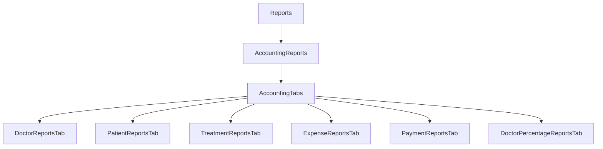
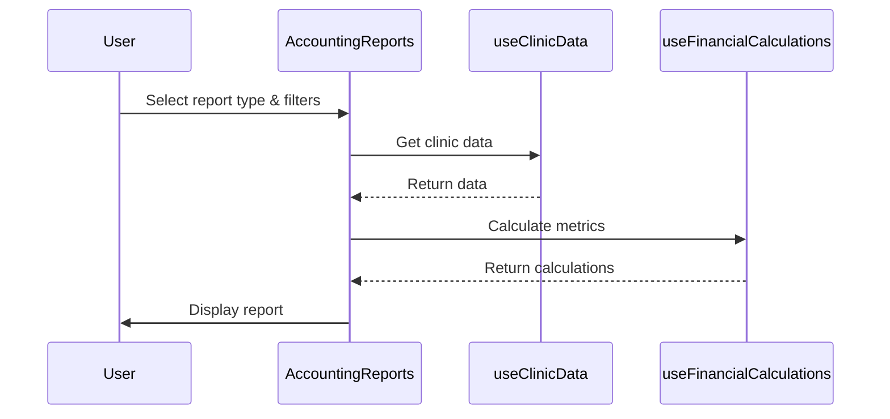

# Accounting Reports Design

## Overview
This document outlines the design for a new accounting reports page that provides detailed financial reporting capabilities for the clinic management system.

## Requirements Analysis
The user requested a separate page with accounting tables/reports including:
- Day/Month/Period reports for doctors
- Day/Month/Period reports for patients  
- Day/Month/Period reports for treatments
- Expense details reports
- Payment details reports
- Doctor percentage reports
- Print functionality for any report

## Architecture Design

### Component Structure

### Data Flow

## Component Details

### 1. AccountingReports (Main Component)
- **Location**: `components/reports/AccountingReports.tsx`
- **Responsibilities**:
  - Main container for accounting reports
  - Manage tab navigation
  - Handle date range filtering
  - Coordinate data fetching and calculations

### 2. Report Tabs

#### DoctorReportsTab
- **Data**: Treatment records, payments, doctor payments
- **Reports**:
  - Daily doctor activity and earnings
  - Monthly doctor performance summary
  - Custom period doctor reports
  - Doctor earnings breakdown by treatment type

#### PatientReportsTab
- **Data**: Patients, treatment records, payments
- **Reports**:
  - Daily patient financial activity
  - Monthly patient payment summary
  - Custom period patient reports
  - Patient balance tracking

#### TreatmentReportsTab
- **Data**: Treatment records, treatment definitions
- **Reports**:
  - Daily treatment revenue
  - Monthly treatment type analysis
  - Custom period treatment reports
  - Treatment profitability analysis

#### ExpenseReportsTab
- **Data**: Expenses, supplier invoices
- **Reports**:
  - Daily expense breakdown
  - Monthly expense by category
  - Custom period expense reports
  - Supplier expense analysis

#### PaymentReportsTab
- **Data**: Payments, treatment records
- **Reports**:
  - Daily payment summary
  - Monthly payment method analysis
  - Custom period payment reports
  - Payment vs revenue comparison

#### DoctorPercentageReportsTab
- **Data**: Treatment records, payments, doctor payments
- **Reports**:
  - Doctor percentage calculations
  - Doctor earnings vs clinic share
  - Treatment type profitability by doctor
  - Doctor payment reconciliation

## Technical Implementation

### Data Structures
The component will leverage existing data structures from `types.ts`:
- `TreatmentRecord` - For treatment data
- `Payment` - For payment data
- `Expense` - For expense data
- `DoctorPayment` - For doctor payment data
- `SupplierInvoice` - For supplier financial data

### Key Features

#### Date Range Filtering
- Implement flexible date range selection
- Support predefined periods (today, this week, this month, this quarter, this year)
- Support custom date ranges

#### Report Generation
- Use `useFinancialCalculations` hook for financial metrics
- Implement custom calculations for accounting-specific metrics
- Support data aggregation by day, month, and custom periods

#### Print Functionality
- Use existing `openPrintWindow` utility
- Create printable versions of each report type
- Ensure proper formatting for Arabic text (RTL support)

#### UI/UX Considerations
- Follow existing design patterns from FinancialAccounts component
- Use consistent color schemes and typography
- Ensure responsive design for different screen sizes
- Provide clear visual hierarchy for report data

## Integration Plan

### Step 1: Create AccountingReports Component
- Implement main container with tab navigation
- Set up basic structure and state management

### Step 2: Implement Individual Report Tabs
- Create each report tab component
- Implement data fetching and calculations
- Design report layouts and visualizations

### Step 3: Add Print Functionality
- Create printable versions of each report
- Integrate with existing print system

### Step 4: Integrate with Reports.tsx
- Add new tab to existing Reports component
- Ensure proper navigation and state management

### Step 5: Testing and Validation
- Test all report types with sample data
- Validate calculations and data accuracy
- Test print functionality
- Ensure responsive design works correctly

## Timeline and Priorities
1. **High Priority**: Core component structure and basic reports
2. **Medium Priority**: Advanced report features and calculations
3. **Low Priority**: Additional visual enhancements and optimizations

## Dependencies
- Existing `useClinicData` hook for data access
- Existing `useFinancialCalculations` hook for financial metrics
- Existing `openPrintWindow` utility for printing
- Existing translation system for Arabic support

## Success Criteria
- All report types are functional and display accurate data
- Print functionality works for all report types
- UI is consistent with existing design patterns
- Performance is acceptable with typical data volumes
- All reports support Arabic language and RTL layout